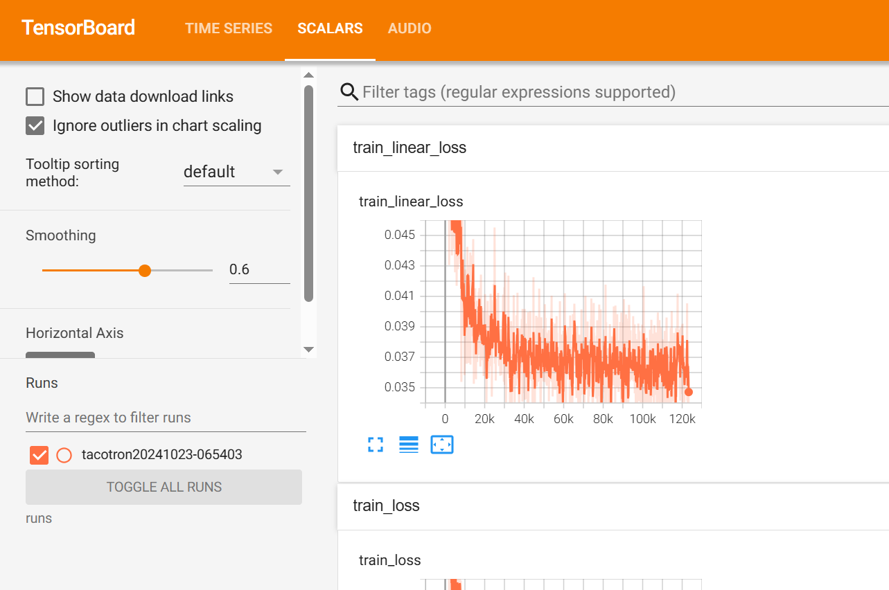
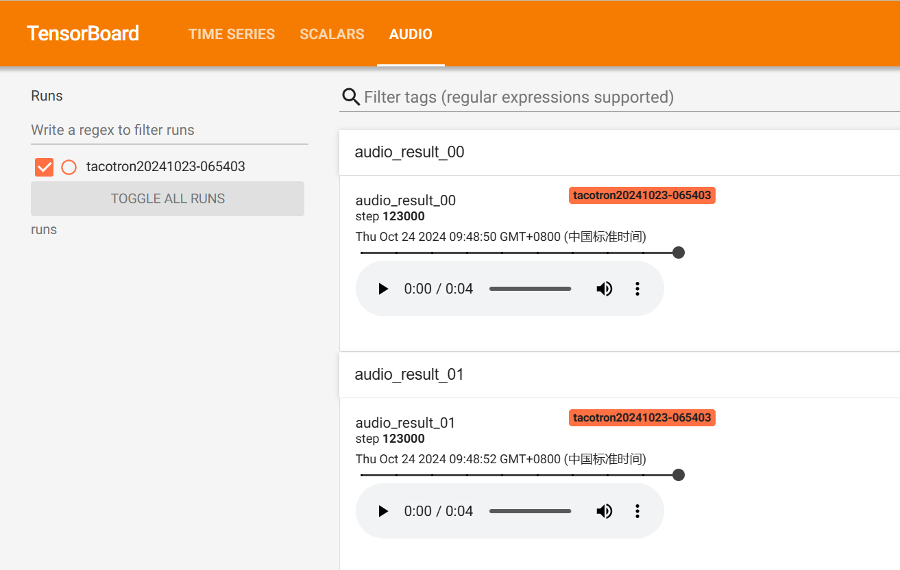
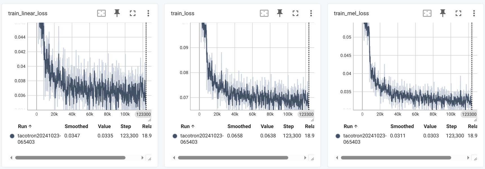

#  Tacotron

An implementation of Tacotron described in the paper using pytorch.
[Tacotron: Towards End-to-End Speech Synthesis
](https://arxiv.org/abs/1703.10135) 

Published in INTERSPEECH 2017

Forked from [dongheehand/Tacotron-PyTorch](https://github.com/dongheehand/Tacotron-PyTorch)

## Requirement

python 3.10
```sh
pip install -r requirements.txt
```


## Datasets
- [LJ-Speech](https://keithito.com/LJ-Speech-Dataset/)
(English)

## Model training
### Train using LJ-Speech dataset

```
python train.py
```

### Tensorboard
- You can see the train loss graph.
- Furthermore, you can listen to generated wav files during training.

| Loss | wav_files |
| --- | --- |
|  | |

```
tensorboard --logdir=runs
```

## Generate TTS wav files
Generate TTS wav files


```
python eval.py --checkpoint_path ./models/checkpoint_120000.pth.tar
```


## Experimental Results
### Train loss
